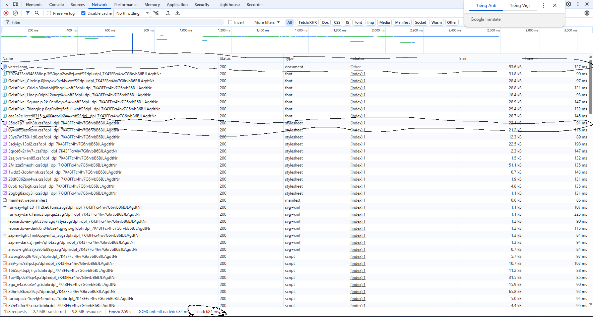

## PHẦN A: KIẾN THỨC CƠ BẢN VỀ TRÌNH DUYỆT VÀ HTML5

### Câu A1: Quy trình tải trang web và Tab Network
> tài liệu tham chiếu: `tuan_1_html5/01_introduction_html_universe.md`

Khi truy cập một trang web (ví dụ: `https://shopee.vn`), trình duyệt thực hiện theo thứ tự 7 bước sau:
1.  **DNS lookup**: Tìm địa chỉ IP của tên miền.
2.  **TCP handshake**: Thiết lập kết nối giữa máy tính và server.
3.  **TLS handshake**: Thiết lập kết nối bảo mật.
4.  **HTTP request**: Trình duyệt gửi yêu cầu dữ liệu đi.
5.  **Server trả Response**: Máy chủ phản hồi và gửi dữ liệu về.
6.  **Parse HTML -> DOM/CSSOM**: Trình duyệt phân tích cấu trúc HTML và CSS.
7.  **Render layout**: Hiển thị giao diện hoàn chỉnh lên màn hình.

Ý 2 Tab **Network** trong DevTools là nơi cung cấp thông tin chi tiết của tất cả các HTTP request diễn ra trong quá trình này.


---

### Câu A2: Tối ưu SEO bằng Semantic HTML
> tài liệu tham chiếu: `tuan_1_html5/04_semantic_html.md`

Việc không sử dụng thẻ Semantic khiến Google đánh giá SEO thấp vì bot khó hiểu được cấu trúc trang. Dưới đây là 4 lỗi phổ biến và cách sửa:

| Lỗi sai (Sử dụng thẻ Div) | Fix lỗi (Sử dụng thẻ Semantic) | Ý nghĩa việc sửa đổi |
| :--- | :--- | :--- |
| `<div class="header">` | `<header>` | Giúp Google nhận diện đây là phần đầu trang. |
| `<div class="logo">` | `<h1>` | Cung cấp heading chính, xác định cấu trúc nội dung. |
| `<div class="menu">` | `<nav><ul><li><a>` | Giúp Screen reader đọc được đây là phần điều hướng. |
| `<div class="main">` | `<main>` | Xác định rõ ràng khu vực chứa nội dung chính của trang. |

---

### Câu A3: Phân biệt Block Element và Inline Element
> tài liệu tham chiếu: ` `

Dựa trên cấu trúc hiển thị của các thẻ phổ biến:

*   **`<div>` (Block element)**: Luôn bắt đầu trên một dòng mới và chiếm toàn bộ chiều rộng có sẵn. Các phần tử khác không thể nằm cùng dòng với nó.
*   **`<span>` (Inline element)**: Chỉ chiếm đúng phần diện tích của nội dung text, nằm cạnh nhau trên cùng một dòng và không tạo ra ngắt dòng.
*   **`<strong>` (Inline element)**: Có tính chất tương tự thẻ `<span>` nhưng định dạng kiểu chữ đậm (Bold) cho văn bản.

---

### Câu A4: Cấu trúc Table và lý do không dùng Table để dàn trang (Layout)
> tài liệu tham chiếu: `tuan_1_html5/05_tables_hyperlinks.md`

#### 1. Các thẻ thành phần trong Table
*   **`<thead>`**: Chứa hàng tiêu đề cột, giúp xác định ý nghĩa từng cột.
*   **`<tbody>`**: Chứa dữ liệu chính của bảng (có thể có nhiều thẻ `<tbody>`).
*   **`<tfoot>`**: Dùng cho phần tổng kết, thống kê hoặc ghi chú cuối bảng.

#### 2. Tại sao không dùng Table để tạo Layout trang web?
*   **Khả năng phản hồi kém**: Bố cục bảng rất cứng nhắc, gây khó khăn khi thiết kế giao diện linh hoạt (Responsive) bằng CSS.
*   **Bảo trì kém**: Cấu trúc bảng lồng nhau làm mã nguồn cồng kềnh, dễ vỡ bố cục khi thay đổi số lượng cột và làm chậm tốc độ tải trang.
*   **SEO & Accessibility kém**: Screen reader đọc bảng theo thứ tự hàng-cột khiến nội dung bị đọc sai logic nếu dùng để dàn trang.

## PHẦN B: THỰC HÀNH VÀ DEBUG

### Bài B3: Phân tích và Sửa lỗi HTML


#### Các lỗi trong sourcecode

*   **Lỗi 1:** Dòng 1 — Khai báo `<!DOCTYPE>` thiếu `html` — **Cách sửa:** `<!DOCTYPE html>`
*   **Lỗi 2:** Dòng 2 — Thẻ `<html>` thiếu thuộc tính `lang` — **Cách sửa:** `<html lang="vi">`
*   **Lỗi 3:** Dòng 4 — Thẻ `<title>` mở nhưng không có thẻ đóng — **Cách sửa:** Bổ sung thẻ đóng `</title>`
*   **Lỗi 4:** Dòng 5 — Sai cú pháp thẻ meta charset — **Cách sửa:** `<meta charset="UTF-8">`
*   **Lỗi 5:** Dòng 8 — Thẻ `<h1>` sử dụng thẻ đóng sai cú pháp — **Cách sửa:** Sửa thành `</h1>`
*   **Lỗi 6:** Dòng 11 — Thuộc tính `href` thiếu dấu `/` và sai cấu trúc — **Cách sửa:** `<a href="/home">`
*   **Lỗi 7:** Dòng 11 — Thẻ `<a>` sử dụng thẻ đóng sai — **Cách sửa:** Sửa thành `</a>`
*   **Lỗi 8:** Dòng 20 — Thẻ `` thiếu dấu nháy cho `src` và thiếu `alt` — **Cách sửa:** ``
*   **Lỗi 9:** Dòng 22 — Các thẻ `<p>` và `<b>` lồng nhau sai thứ tự đóng — **Cách sửa:** `<p>Giá: <b>25.990.000đ</b></p>`
*   **Lỗi 10:** Dòng 27 — Thẻ `<table>` thiếu phần `<thead>` và tiêu đề `<th>` — **Cách sửa:** Bổ sung `<thead>` và dùng thẻ `<th>` cho hàng đầu.
*   **Lỗi 11:** Dòng 40 — Xuất hiện thẻ `<main>` thứ hai trong một trang — **Cách sửa:** Đổi thành thẻ `<aside>`
*   **Lỗi 12:** Dòng 45 — Thẻ đoạn văn `<p>` chưa được đóng — **Cách sửa:** Bổ sung thẻ đóng `</p>`


## PHẦN C:

### Bài C1:
```html

<!-- Header: Phần đầu trang -->
<header>
    <nav> <!-- nav: Chứa các liên kết điều hướng chính của web -->
        <a href="#">Trang chủ</a>
        <a href="#">Sản phẩm</a>
    </nav>
</header>

<main> <!-- main: Bao bọc nội dung chính của trang chi tiết sản phẩm -->

    <!-- Breadcrumb: Đường dẫn vị trí -->
    <nav> <!-- nav: Điều hướng phụ để người dùng quay lại các danh mục cha -->
        <ol> <!-- ol: Danh sách có thứ tự vì breadcrumb có tính phân cấp -->
            <li>Trang chủ</li>
            <li>Điện thoại</li>
            <li>iPhone 16</li>
        </ol>
    </nav>

    <!-- Khu vực ảnh: 5 ảnh -->
    <section> <!-- section: Nhóm các ảnh sản phẩm thành một vùng riêng -->
        
        
        
        
        
    </section>

    <!-- Thông tin sản phẩm -->
    <section>
        <h1>iPhone 16 Pro Max</h1> <!-- h1: Tên sản phẩm, tiêu đề quan trọng nhất -->
        <p>Giá: <strong>30.000.000đ</strong></p> <!-- strong: Nhấn mạnh vào giá tiền -->
        <p>Đánh giá: 5/5 sao</p>
        <article> <!-- article: Đoạn mô tả sản phẩm có thể đứng độc lập -->
            <h2>Mô tả</h2>
            <p>Nội dung mô tả ngắn gọn về máy...</p>
        </article>
    </section>

    <!-- Thông số kỹ thuật -->
    <section>
        <table> <!-- table: Dùng để trình bày dữ liệu so sánh/thông số -->
            <tr>
                <td>Màn hình</td>
                <td>6.7 inch</td>
            </tr>
            <tr>
                <td>Chip</td>
                <td>A18 Pro</td>
            </tr>
        </table>
    </section>

    <!-- Đánh giá/Bình luận -->
    <section>
        <h2>Bình luận</h2>
        <article> <!-- article: Mỗi bình luận là một đơn vị nội dung riêng lẻ -->
            <p><strong>Nguyễn Văn A:</strong> Máy rất đẹp!</p>
        </article>
    </section>

    <!-- Sidebar: Sản phẩm tương tự -->
    <aside> <!-- aside: Chứa thông tin liên quan nhưng không phải nội dung chính -->
        <h3>Sản phẩm tương tự</h3>
        <ul>
            <li>iPhone 15 Pro</li>
            <li>iPhone 14 Pro</li>
        </ul>
    </aside>

</main>

<!-- Footer: Chân trang -->
<footer>
    <p>&copy; 2026 Shop của m</p>
</footer>

```

### Bài C2:

####   Quan điểm "chỉ cần dùng <div> và class" là một tư duy sai lầm trong lập trình web hiện đại vì hai lý do kỹ thuật cốt lõi:

*   **SEO (Tối ưu tìm kiếm):** Các công cụ tìm kiếm như Google dựa vào thẻ HTML để hiểu cấu trúc trang. Khi m dùng <main>, <article> hay <header>, m đang giúp Google Bot nhận diện đâu là nội dung quan trọng nhất. Một trang web toàn thẻ <div> sẽ khiến nội dung bị coi là thiếu cấu trúc, từ đó làm tụt thứ hạng tìm kiếm của trang.

*   **Accessibility (Khả năng truy cập):** Đây là yếu tố nhân văn giúp người khiếm thị sử dụng Screen Reader để lướt web. Screen Reader dựa vào các thẻ như <nav>, <button> để định vị các "cột mốc" trên trang. Nếu m chỉ dùng <div>, người dùng sẽ hoàn toàn bị lạc lối vì không xác định được các khu vực chức năng.

*   **Ví dụ thực tế:** Thẻ <button> chuẩn mặc định đã hỗ trợ tương tác bằng bàn phím (phím Enter/Space) và có trạng thái "focus". Nếu dùng <div class="btn">, m sẽ phải viết thêm rất nhiều dòng JavaScript chỉ để giả lập lại những tính năng cơ bản mà lẽ ra một thẻ Semantic đã có sẵn từ đầu.

*   **Trường hợp <div> vẫn phù hợp:** Thẻ <div> nên được dùng đúng chức năng là một cái "hộp" trung lập để bao bọc và căn chỉnh giao diện (như dùng Flexbox hoặc Grid) khi khối đó không mang ý nghĩa nội dung cụ thể nào cần định nghĩa cho trình duyệt.