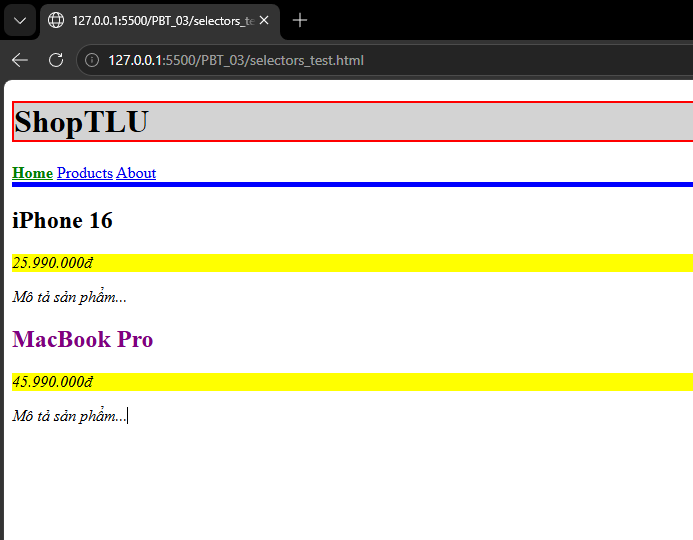
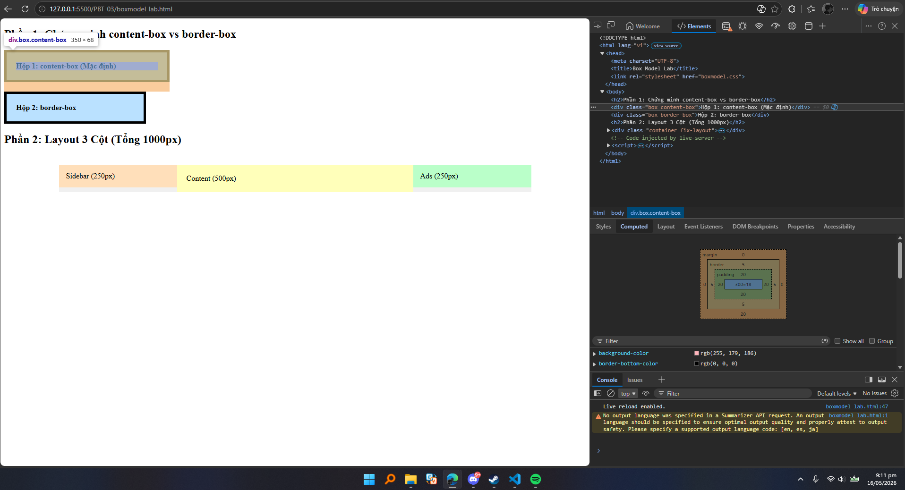
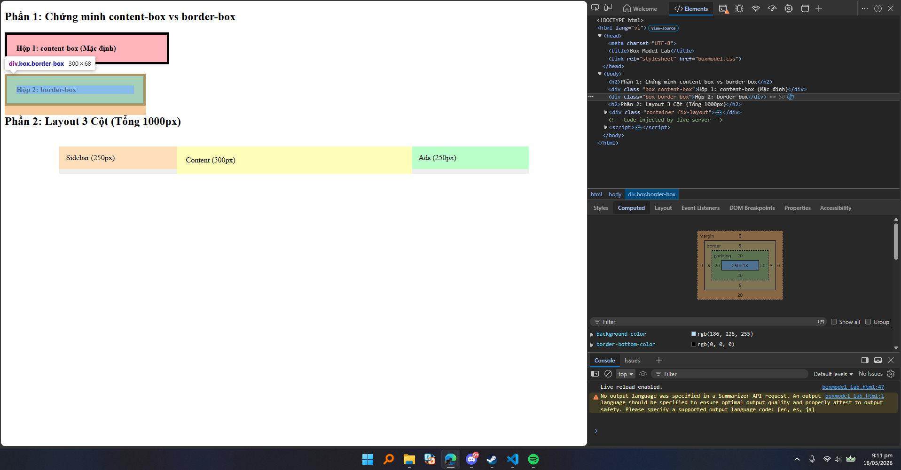
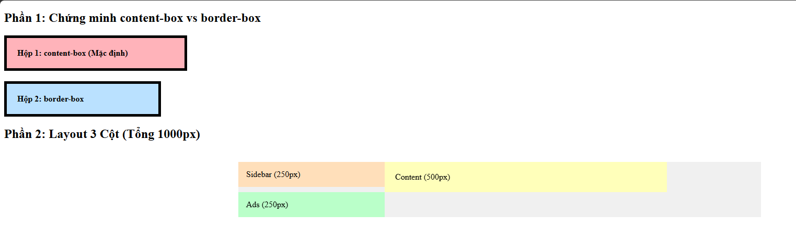
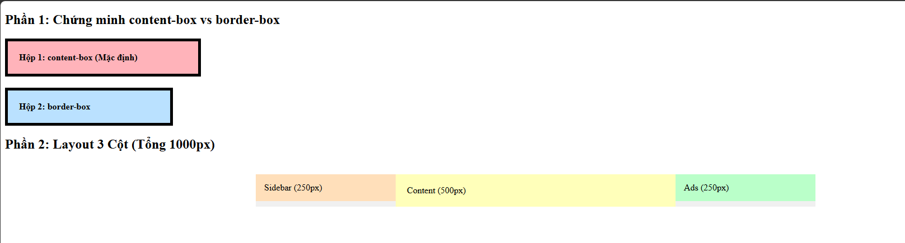
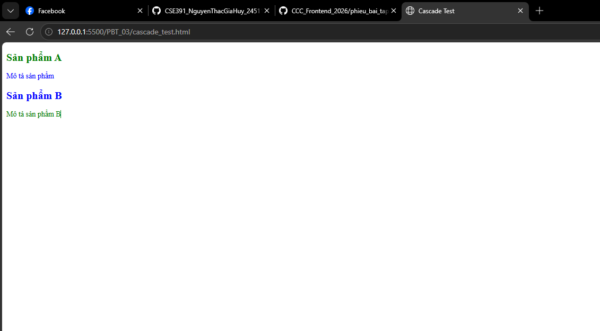

# PHẦN A — KIỂM TRA ĐỌC HIỂU

### Câu A1 — 3 Cách nhúng CSS
>Tài liệu tham chiếu: 08_introduction_css.md

1. **Inline CSS (Trực tiếp)**
   - Ví dụ: `<h1 style="color: red;">Title</h1>`
   - Ưu điểm: Áp dụng nhanh, độ ưu tiên cao nhất.
   - Nhược điểm: Khó bảo trì, code HTML bị rối, không tái sử dụng được.
   - Khi nào dùng: Khi cần test nhanh hoặc dùng JavaScript can thiệp style động.
2. **Internal CSS (Trong file HTML)**
   - Ví dụ: `` (đặt trong `<head>`)
   - Ưu điểm: Áp dụng cho toàn bộ file hiện tại, không cần tạo file ngoài.
   - Nhược điểm: Không chia sẻ style được cho các trang HTML khác, làm file HTML nặng.
   - Khi nào dùng: Khi làm các trang web đơn giản chỉ có 1 trang duy nhất (Landing page nhỏ) hoặc email template.
3. **External CSS (File ngoài)**
   - Ví dụ: `<link rel="stylesheet" href="style.css">`
   - Ưu điểm: Tái sử dụng được cho nhiều trang, code sạch, trình duyệt có thể cache file CSS giúp tải trang nhanh hơn.
   - Nhược điểm: Cần tốn thêm 1 request HTTP để tải file về.
   - Khi nào dùng: Sử dụng trong 99% các dự án thực tế.

*Câu hỏi thêm:* Nếu cả 3 cách cùng áp dụng, **Inline CSS** sẽ "thắng" vì nó có Specificity (độ ưu tiên) cao nhất (áp dụng trực tiếp lên thẻ).

### Câu A2 — CSS Selectors
1. `h1` → Chọn: ShopTLU
2. `.price` → Chọn: 25.990.000đ, 45.990.000đ
3. `#app header` → Chọn: Toàn bộ khối `<header class="top-bar dark">...</header>`
4. `nav a:first-child` → Chọn: Home
5. `.product.featured h2` → Chọn: MacBook Pro
6. `article > p` → Chọn: 25.990.000đ, Mô tả sản phẩm..., 45.990.000đ, Mô tả sản phẩm...
7. `a[href="/"]` → Chọn: Home
8. `.top-bar.dark h1` → Chọn: ShopTLU

### Câu A3 — Box Model
- **Trường hợp 1 (content-box):**
  - Chiều rộng hiển thị = 400 (width) + 40 (padding) + 10 (border) = 450px
  - Không gian chiếm = 450 + 20 (margin) = 470px
- **Trường hợp 2 (border-box):**
  - Chiều rộng hiển thị = 400px
  - Content thực tế = 400 - 40 (padding) - 10 (border) = 350px
  - Không gian chiếm = 400 + 20 (margin) = 420px
- **Trường hợp 3 (Margin collapse):**
  - Khoảng cách giữa box-a và box-b = 40px
  - Giải thích: Margin dọc (top/bottom) của các block level elements khi đứng cạnh nhau sẽ bị "collapse" (gộp lại) và lấy giá trị lớn nhất, chứ không cộng dồn.
  - Nâng cao: Khoảng cách = 40 + (-10) = 30px.

### Câu A4 — Specificity
- Rule A (`p`): (0, 0, 1)
- Rule B (`.price`): (0, 1, 0)
- Rule C (`#main-price`): (1, 0, 0)
- Rule D (`p.price`): (0, 1, 1)
- Element có màu: **Đỏ (Red)** vì Rule C (chứa ID) có điểm specificity cao nhất.
- Nếu có inline style: Element có màu **Cam (Orange)** vì Inline style (1,0,0,0) mạnh hơn ID.
- Nếu Rule A thêm `!important`: Element có màu **Đen (Black)** vì `!important` phá vỡ mọi quy tắc ưu tiên thông thường.

---

# PHẦN B — TRẢ LỜI CODE (Ghi chú)

### Bài B1 — Các loại Selector đã sử dụng
1. **Universal Selector (Bộ chọn toàn cục):** `*` (áp dụng box-sizing cho mọi phần tử).
2. **Element Selector (Bộ chọn thẻ):** `body`, `header`, `table`, `th` (áp dụng style trực tiếp lên thẻ HTML).
3. **Class Selector (Bộ chọn lớp):** `.wrapper`, `.active` (chọn các phần tử có chung class).
4. **ID Selector (Bộ chọn ID):** `#contact a` (chọn thẻ a nằm trong phần tử có id là contact).
5. **Descendant Selector (Bộ chọn hậu duệ):** `nav a`, `header h1` (chọn phần tử con nằm trong phần tử cha).
6. **Pseudo-class Selector (Bộ chọn trạng thái):** `nav a:hover`, `tr:nth-child(even)`, `tr:hover` (chọn trạng thái tương tác hoặc thứ tự của phần tử).

### Bài B2 — Box Model Lab
#### Phần 1
- Hộp 1 (content-box): chiều rộng thực tế = 350px 

- Hộp 2 (border-box): chiều rộng thực tế = 300px

- Giải thích: `content-box` cộng dồn padding và border ra ngoài kích thước khai báo. `border-box` ép padding và border bóp ngược vào trong, giữ nguyên tổng kích thước khai báo.

#### Phần 2

### Bài B3 — Specificity Battle
1. `*` (0,0,0)
2. `p` (0,0,1)
3. `p.text` (0,1,1)
4. `.highlight` (0,1,0)
5. `.text.highlight` (0,2,0)
6. `p.text.highlight` (0,2,1)
7. `#demo` (1,0,0)
8. `p#demo` (1,0,1)
9. `#demo.text.highlight` (1,2,0)
10. `p#demo.text.highlight` (1,2,1)
- Element hiển thị màu của Rule 10 vì điểm ưu tiên cao nhất. Thay đổi thứ tự file CSS không làm đổi màu trừ khi có 2 rule bằng điểm nhau (rule viết sau sẽ thắng).

---

# PHẦN C — DEBUG & SUY LUẬN

### Câu C1 — Debug CSS Layout
- Kích thước thực tế Sidebar: 300 + 40 (padding) + 2 (border) = 342px
- Kích thước thực tế Content: 660 + 60 (padding) + 2 (border) = 722px
- Giải thích: Tổng chiều rộng 2 cột là 342 + 722 = 1064px. Container chỉ có 960px. Do vượt quá 960px, cột content bị đẩy xuống dòng.

### Câu C2 — Cascade Puzzle
1. "Sản phẩm A": font-size = 20px (từ `.card .title`), color = green (do `.highlight !important`).
2. "Mô tả sản phẩm" (trong featured): color = blue (do thẻ `p` có `color: inherit` sẽ kế thừa màu xanh từ cha là `.card`).
3. "Sản phẩm B": font-size = 20px (từ `.card .title`), color = blue (kế thừa từ `.card`).
4. "Mô tả sản phẩm B": color = green (bị `.highlight !important` đè).

