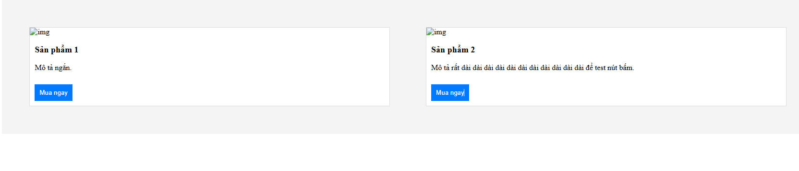
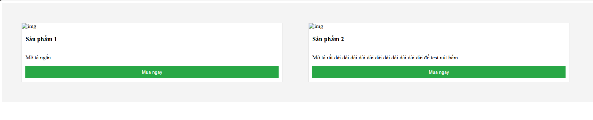
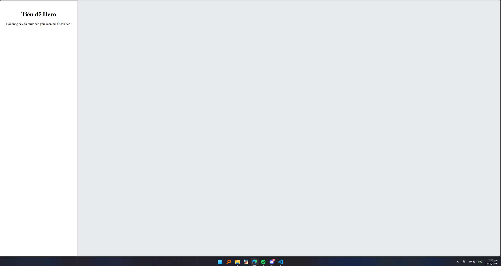
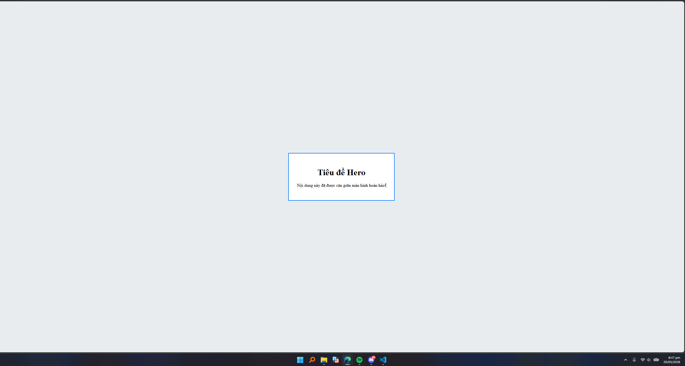
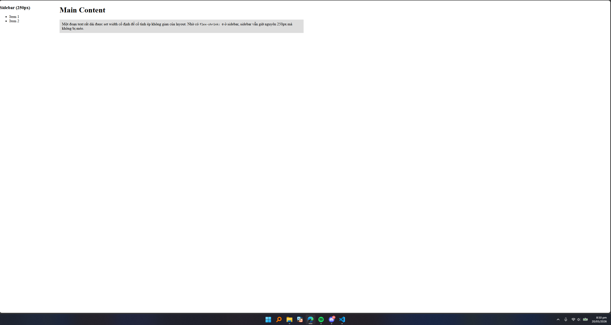
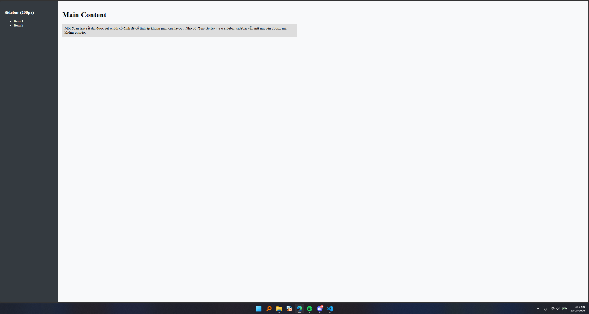

# 📝 BÀI LÀM PHIẾU BÀI TẬP 04: CSS LAYOUT

## PHẦN A — KIỂM TRA ĐỌC HIỂU

### Câu A1 — 5 Loại Positioning

#### Bảng so sánh thuộc tính Position:

| Position | Vẫn chiếm chỗ trong flow? | Tham chiếu vị trí | Cuộn theo trang? | Use case thực tế |
| :--- | :---: | :--- | :---: | :--- |
| `static` | **Có** | Không có (Mặc định theo luồng tự nhiên) | **Có** | Trạng thái mặc định của mọi phần tử khi chưa định vị. |
| `relative` | **Có** | Vị trí ban đầu của chính nó | **Có** | Tinh chỉnh dịch chuyển nhỏ; làm gốc tọa độ cho phần tử con dùng `absolute`. |
| `absolute` | **Không** | Tổ tiên gần nhất có position khác `static` | **Có** | Làm nhãn đè lên ảnh (Badge HOT), tooltip, menu dropdown, nút đóng pop-up. |
| `fixed` | **Không** | Viewport (Khung nhìn trình duyệt) | **Không** | Thanh điều hướng trên cùng (Fixed Header), nút cuộn nhanh lên đầu trang (Back to top). |
| `sticky` | **Có** | Viewport và phần tử cha chứa nó | **Cuộn đến ngưỡng** | Thanh tiêu đề của bảng (table header), thanh công cụ hoặc sidebar cuộn dọc cố định khi đọc bài viết dài. |

#### Câu hỏi thêm:
* **Khi nào `absolute` tham chiếu `body`?** Khi tất cả các phần tử cha, ông (các tổ tiên bọc ngoài nó trong cây DOM) đều không khai báo thuộc tính `position` (hoặc chỉ có `position: static` mặc định). Lúc này, nó sẽ tìm lên tận cùng và lấy thẻ `<body>` (hoặc viewport) làm gốc tọa độ.
* **Khi nào tham chiếu parent?** Khi phần tử cha trực tiếp (hoặc cha gián tiếp gần nó nhất) được khai báo một thuộc tính `position` hợp lệ khác `static` (thường là `position: relative;`).
* **Giải thích khái niệm "nearest positioned ancestor":** Đây là **phần tử tổ tiên gần nhất** (ngược dòng cây DOM từ phần tử hiện tại đi lên) có thuộc tính `position` mang một trong các giá trị: `relative`, `absolute`, `fixed`, hoặc `sticky`. Nó đóng vai trò là "mốc neo" (gốc tọa độ $(0,0)$) để tính toán các khoảng cách `top`, `bottom`, `left`, `right` cho phần tử định vị `absolute`.

---

### Câu A2 — Dự đoán Layout (Flexbox vs Grid)

* **Trường hợp 1:** Bố cục gồm **1 hàng ngang** duy nhất chứa 4 items. Nhờ thuộc tính `flex: 1;`, toàn bộ không gian trống của container được chia đều, giúp cả 4 items có chiều rộng **bằng nhau tuyệt đối** (mỗi item chiếm đúng 25%).
* **Trường hợp 2:** Bố cục chia thành **3 hàng và 2 cột**. Do mỗi item có kích thước `width: 45%` kèm `margin: 2.5%` cho cả hai bên trái/phải (tổng cộng không gian một item chiếm dụng là $45\% + 2.5\% \times 2 = 50\%$). Một hàng ngang vừa vặn chứa đủ 2 items, 6 items sẽ chia đều vào 3 hàng.
* **Trường hợp 3:** Bố cục gồm **1 hàng ngang** chứa 3 items và các item được **căn giữa hoàn hảo theo chiều dọc**. Do có `justify-content: space-between`, item đầu tiên sẽ dính sát mép trái, item cuối dính sát mép phải, và item thứ hai nằm chính giữa container.
* **Trường hợp 4:** Bố cục chia làm **3 cột trên 1 hàng**. Cột bên trái rộng cố định `200px`, cột bên phải rộng cố định `200px`. Cột ở giữa linh hoạt co giãn (`1fr`) chiếm toàn bộ phần diện tích còn lại. Các cột cách nhau một khoảng `20px`.
* **Trường hợp 5:** Bố cục dạng lưới gồm **3 cột đều nhau** (`repeat(3, 1fr)`). Với tổng số 7 items, lưới sẽ tự động tính toán thành **3 hàng**. Hàng một và hàng hai lấp đầy mỗi hàng 3 items. Item thứ 7 (cuối cùng) bị đẩy xuống hàng thứ ba và nằm cô độc tại cột đầu tiên (bên trái).

---

## PHẦN C — SUY LUẬN

### Câu C1 — Flexbox vs Grid: Khi nào dùng gì?

1. **Navigation bar ngang (logo + menu + buttons):**
   * **Lựa chọn:** **Flexbox**
   * **Giải thích:** Thanh điều hướng là bố cục một chiều (1D) theo trục ngang. Flexbox tối ưu cấu trúc này cực tốt thông qua cơ chế phân bổ không gian linh hoạt bằng `justify-content: space-between`.
2. **Lưới ảnh Instagram (3 cột đều nhau, số ảnh không biết trước):**
   * **Lựa chọn:** **Grid**
   * **Giải thích:** Đây là tập hợp bố cục hai chiều (2D) dạng ma trận dòng - cột nghiêm ngặt. Sử dụng CSS Grid với cấu hình `grid-template-columns: repeat(3, 1fr);` giúp tự động căn thẳng hàng các ô ảnh mà không phụ thuộc vào số lượng ảnh tải lên.
3. **Layout blog: main content + sidebar:**
   * **Lựa chọn:** **Grid**
   * **Giải thích:** Thích hợp để xây dựng khung sườn (Macro layout) tổng thể của trang web. Grid giúp chúng ta định hình vùng hiển thị lớn có kích thước bất đối xứng rõ ràng (ví dụ: cột chính chiếm `3fr`, cột phụ sidebar chiếm `1fr`).
4. **Footer với 4 cột thông tin:**
   * **Lựa chọn:** **Grid** (Hoặc kết hợp cả hai)
   * **Giải thích:** Sử dụng Grid giúp kiểm soát sự đồng đều về mặt kích thước của cả 4 cột một cách hoàn hảo nhất, đảm bảo các cột không bị méo mó hay lệch chiều rộng khi lượng chữ bên trong mỗi cột chênh lệch nhau.
5. **Card sản phẩm (ảnh trên, text giữa, nút dưới):**
   * **Lựa chọn:** **Flexbox**
   * **Giải thích:** Phù hợp cho cấu trúc thành phần nhỏ (Micro layout) xếp theo một chiều dọc (`flex-direction: column`). Cơ chế Flexbox cho phép chúng ta áp dụng mẹo `margin-top: auto` vào nút "Mua", lập tức đẩy nó dính chặt vào đáy card dù phần mô tả chữ dài hay ngắn.

---

### Câu C2 — Debug Flexbox

#### ❌ Lỗi 1: Cards không đều chiều cao — nút "Mua" bị nhảy lên/xuống
* **Nguyên nhân:** Bản thân các thẻ `.card` thì có chiều cao bằng nhau (nhờ cơ chế `align-items: stretch` mặc định của khối `.card-container`). Tuy nhiên, cấu trúc bên trong mỗi thẻ `.card` lại chảy theo luồng block bình thường, chưa kích hoạt Flexbox, dẫn đến việc nút bấm bị bám đuôi ngay sau đoạn chữ ngắn/dài thay vì dính đáy.
* **Code sửa lỗi:**
```css
.card-container { 
    display: flex; 
    flex-wrap: wrap; 
}
.card { 
    width: 30%; 
    margin: 1.5%; 
    /* Kích hoạt flex hướng dọc cho từng card */
    display: flex;
    flex-direction: column;
}
.card img { width: 100%; }
.card h3 { font-size: 18px; }
.card .btn { 
    padding: 10px; 
    /* Đẩy nút tự động bám sát đáy thẻ card */
    margin-top: auto; 
}
```
- Lỗi


- Sau khi sửa


#### ❌ Lỗi 2: Muốn items nằm giữa cả ngang lẫn dọc trong container 100vh, nhưng item vẫn dính góc trái trên
* **Nguyên nhân:** Thuộc tính text-align: center chỉ có tác dụng căn chỉnh nội dung chữ hoặc inline-element nội bộ bên trong khối con .hero-content. Khối .hero cha tuy đã bật display: flex nhưng lại quên không chỉ định các luật căn chỉnh trục chính (justify-content) và căn dọc trục phụ (align-items).

* **Code sửa lỗi:**
```css
.hero {
    height: 100vh;
    display: flex;
    /* Căn giữa phần tử con theo trục ngang */
    justify-content: center;
    /* Căn giữa phần tử con theo trục dọc */
    align-items: center;
}
.hero-content {
    text-align: center;
}
```

- Lỗi


- Sau khi sửa


#### ❌ Lỗi 3: Sidebar bị co lại khi content quá dài
* **Nguyên nhân:** Các phần tử con nằm trong Flex container mặc định có thuộc tính flex-shrink: 1. Khi vùng nội dung chính .content chứa quá nhiều text dài, cơ chế này sẽ tự động bóp nghẹt, nén chiều rộng của phần tử bên cạnh (là .sidebar) nhỏ hơn mức 250px ban đầu để nhường chỗ.

* **Code sửa lỗi:**
```css
.layout { 
    display: flex; 
}
.sidebar { 
    width: 250px; 
    /* Chặn tuyệt đối không cho phép Flexbox co nén sidebar */
    flex-shrink: 0; 
}
.content { 
    flex: 1; 
}
```
- Lỗi


- Sau khi sửa
