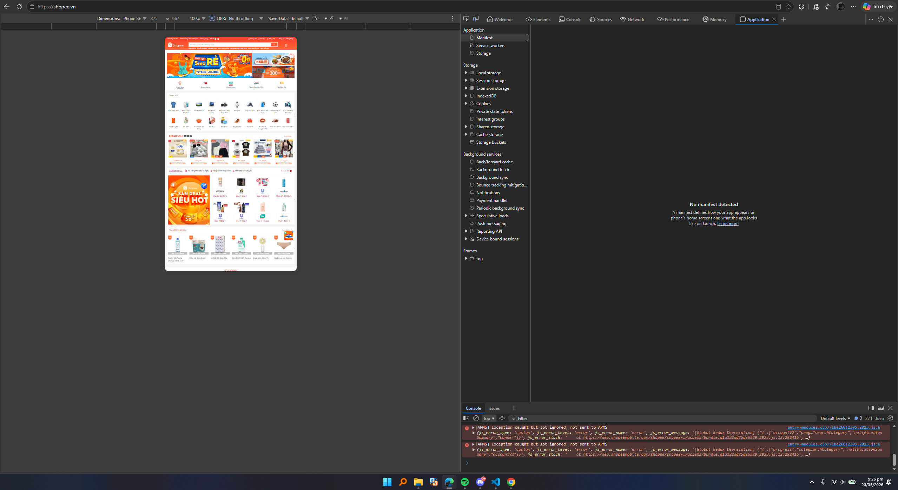
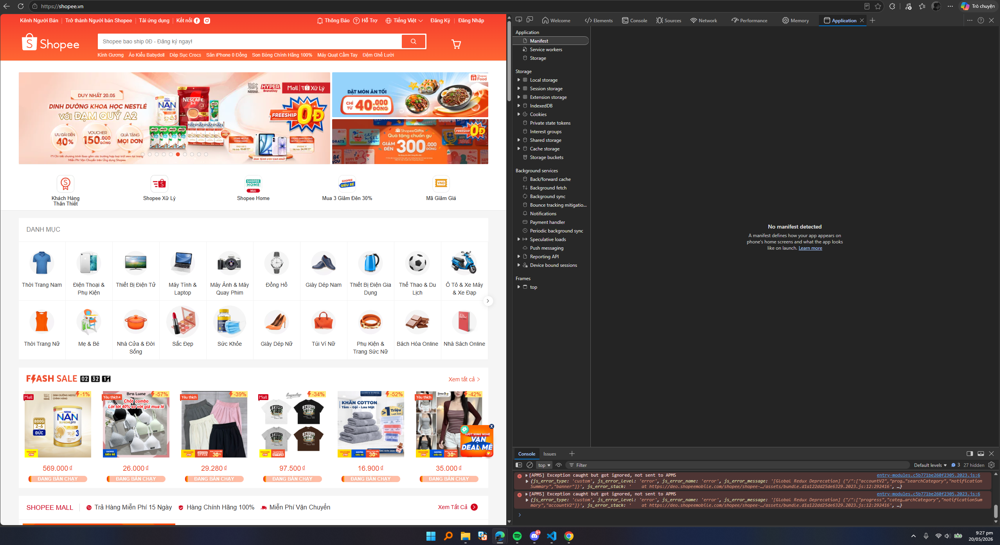
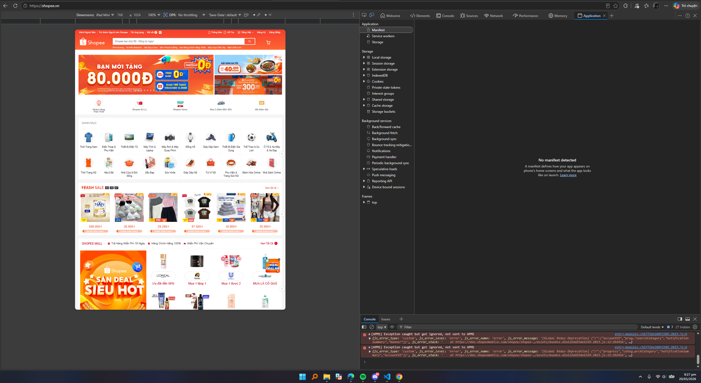

# PHẦN A — KIỂM TRA ĐỌC HIỂU

### Câu A1 — Viewport & Mobile-First
1. **Thẻ `<meta viewport>` chuẩn:**
   `<meta name="viewport" content="width=device-width, initial-scale=1.0">`
   - `width=device-width`: Đặt chiều rộng của trang web bằng đúng chiều rộng vật lý của màn hình thiết bị.
   - `initial-scale=1.0`: Mức độ thu phóng ban đầu là 100% (không bị zoom to hay zoom nhỏ khi mới load).
2. **Nếu thiếu thẻ này:** Trình duyệt trên điện thoại (như Safari trên iPhone) sẽ giả lập màn hình là màn hình Desktop (thường rộng 980px), sau đó thu nhỏ toàn bộ trang web lại cho vừa màn hình điện thoại. Kết quả là chữ và hình ảnh sẽ cực kỳ bé, người dùng phải zoom bằng tay mới đọc được.
3. **Mobile-First vs Desktop-First:**
   - **Mobile-First:** Code CSS mặc định cho màn hình nhỏ trước (Mobile). Màn hình lớn hơn thì dùng `@media (min-width: ...)` để ghi đè.
     *Ví dụ:* `.box { width: 100%; } @media (min-width: 768px) { .box { width: 50%; } }`
   - **Desktop-First:** Code CSS mặc định cho màn hình to trước. Màn hình nhỏ dùng `@media (max-width: ...)` để bóp lại.
     *Ví dụ:* `.box { width: 50%; } @media (max-width: 767px) { .box { width: 100%; } }`
   - **Lý do khuyên dùng Mobile-First:** Giúp tối ưu hóa hiệu suất cho thiết bị di động (tải ít CSS phức tạp hơn, tải nhanh hơn), phù hợp với xu hướng người dùng duyệt web bằng điện thoại là chủ yếu hiện nay.

### Câu A2 — Breakpoints Chuẩn (Bootstrap 5)
- **< 576px:** Điện thoại dọc (Smartphone portrait) — Lưới: 1 cột.
- **576px:** Điện thoại ngang (Smartphone landscape) — Lưới: 1 - 2 cột.
- **768px:** Máy tính bảng (Tablet / iPad) — Lưới: 2 - 3 cột.
- **992px:** Desktop nhỏ (Laptop) — Lưới: 3 - 4 cột.
- **1200px:** Desktop lớn — Lưới: 4 cột.
- **1400px:** Màn hình siêu lớn (Ultra-wide).

### Câu A3 — Media Queries (Điền bảng)

| Chiều rộng màn hình | `.container` width | Giải thích |
|---------------------|--------------------|------------|
| 375px (iPhone SE)   | **100%** | Dưới 576px, nhận CSS mặc định ở ngoài. |
| 600px               | **540px** | Lọt vào min-width: 576px. |
| 800px               | **720px** | Lọt vào min-width: 768px (ghi đè cái 576). |
| 1000px              | **960px** | Lọt vào min-width: 992px. |
| 1400px              | **1140px** | Lọt vào min-width: 1200px. |

### Câu A4 — SCSS Basics
1. **Variables:** Cho phép lưu trữ màu sắc, font, kích thước để dùng lại nhiều lần. Đổi 1 chỗ là đổi toàn trang.
   *Ví dụ:* `$primary-color: #3498db; body { color: $primary-color; }`
2. **Nesting:** Cho phép viết CSS lồng nhau theo đúng cấu trúc phân cấp của HTML, code dễ đọc hơn.
   *Ví dụ:* `.nav { ul { margin: 0; } a { color: red; } }`
3. **Mixins:** Gom một đoạn code CSS lại thành 1 "hàm" để gọi lại ở nhiều nơi (có thể truyền tham số).
   *Ví dụ:* `@mixin flex-center { display: flex; justify-content: center; align-items: center; } .box { @include flex-center; }`
4. **@extend:** Cho phép một class "kế thừa" toàn bộ thuộc tính CSS của một class khác.
   *Ví dụ:* `.btn { padding: 10px; } .btn-red { @extend .btn; background: red; }`
- **Tại sao browser không đọc được:** Trình duyệt chỉ được lập trình để hiểu CSS thuần (CSS chuẩn).
- **Cách chuyển đổi:** Cần một trình biên dịch (Compiler) như thư viện `sass` của Node.js, hoặc extension "Live Sass Compiler" trên VS Code để dịch file `.scss` thành file `.css`.

---

# PHẦN C — PHÂN TÍCH RESPONSIVE TRANG WEB THỰC TẾ

### Câu C1 — Phân tích trang web Shopee.vn 

1. **Navigation thay đổi:**
   - Desktop: Có thanh tìm kiếm to, menu ngang đầy đủ link.
   - Mobile/Tablet: Bị rút gọn thành icon kính lúp, thêm icon Hamburger (☰) hoặc thanh Bottom Navigation.
2. **Lưới content (Sản phẩm gợi ý):**
   - Desktop (1440px): 6 cột.
   - Tablet (768px): 3 hoặc 4 cột.
   - Mobile (375px): 2 cột (hoặc kéo vuốt ngang).
3. **Elements bị ẩn:** Các banner quảng cáo phụ 2 bên, menu danh mục con dài dòng thường bị ẩn trên mobile để tiết kiệm diện tích.
4. **Font size:** Trên mobile font thường to hơn một chút hoặc giữ nguyên, khoảng cách (padding/margin) bị ép nhỏ lại.
- Mobile



- Desktop



- Tablet




### Câu C2 — Thiết kế Strategy Đặt bàn nhà hàng
- **Mobile (< 768px):** Layout 1 cột. Menu bị giấu vào nút Hamburger. Hero image chiếm 50vh. Form đặt bàn nằm dọc (các thẻ input nằm chồng lên nhau). Grid ảnh món ăn: 1 cột. Bản đồ nằm dưới cùng.
- **Tablet (≥ 768px):** Layout 2 cột. Grid ảnh món ăn chia 2 cột. Form đặt bàn bắt đầu chia lưới (VD: cột trái chọn ngày, cột phải chọn giờ).
- **Desktop (≥ 1024px):** Header menu trải ngang. Grid ảnh món ăn: 3 cột. Ở phần đặt bàn, Form nằm bên trái (chiếm 60%), Bản đồ Google Map nằm ngay bên phải Form (chiếm 40%).

**CSS Skeleton (Mobile-First):**
```css
/* Mặc định Mobile (1 cột) */
.layout-dat-ban { display: grid; grid-template-columns: 1fr; gap: 20px; }
.grid-mon-an { display: grid; grid-template-columns: 1fr; gap: 15px; }

/* Tablet */
@media (min-width: 768px) {
    .grid-mon-an { grid-template-columns: repeat(2, 1fr); }
}

/* Desktop */
@media (min-width: 1024px) {
    .grid-mon-an { grid-template-columns: repeat(3, 1fr); }
    .layout-dat-ban { grid-template-columns: 60% 40%; /* Form bên trái, Map bên phải */ }
}
``` 
