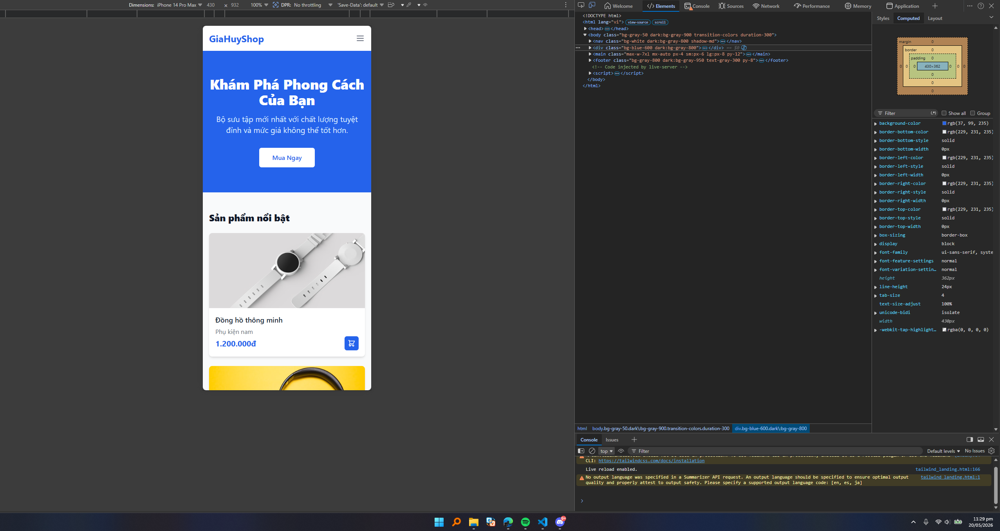
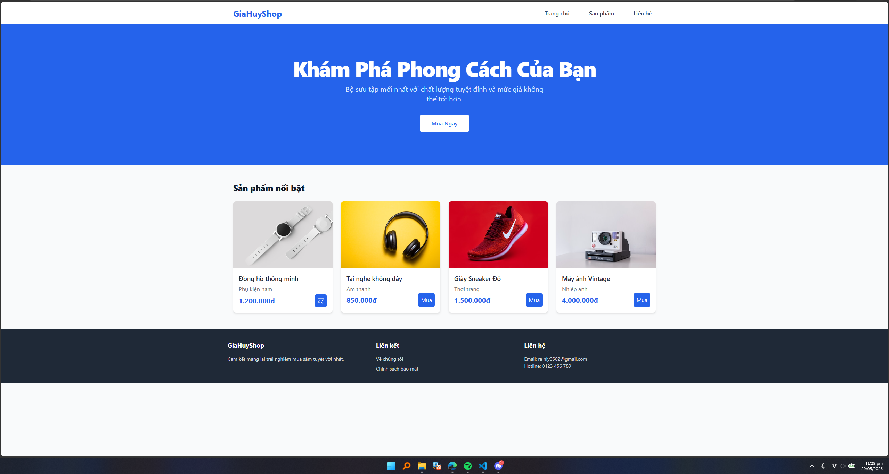
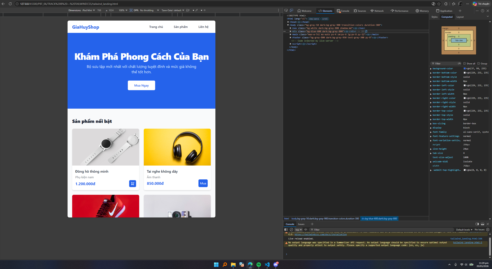
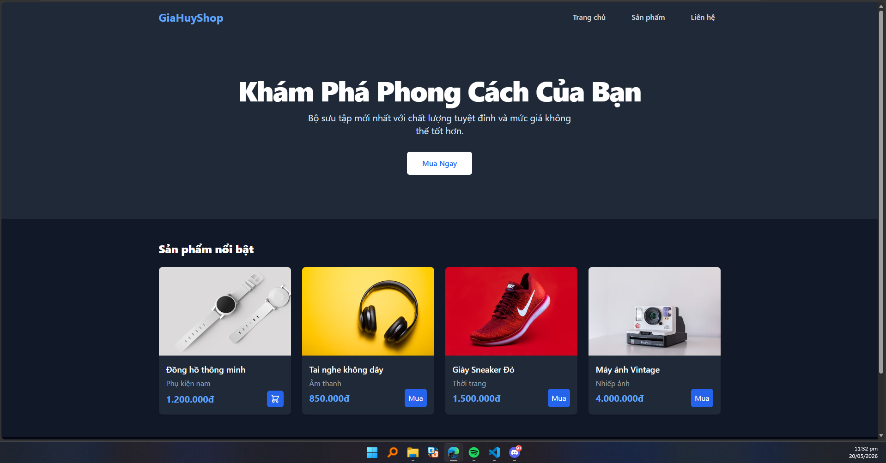

# PHẦN A — ĐỌC HIỂU (TRACK B - TAILWINDCSS)

### Câu A1 — Utility Classes
Giải thích các class trong đoạn mã:
- `flex` → `display: flex;` (Kích hoạt Flexbox)
- `items-center` → `align-items: center;` (Căn giữa các phần tử theo trục dọc)
- `justify-between` → `justify-content: space-between;` (Đẩy các phần tử ra xa nhau sát 2 mép)
- `p-4` → `padding: 1rem;` (Tạo khoảng đệm bên trong 16px)
- `bg-white` → `background-color: #fff;` (Nền màu trắng)
- `shadow-md` → Tạo đổ bóng (box-shadow) mức độ trung bình.
- `rounded-lg` → `border-radius: 0.5rem;` (Bo góc lớn)
- `hover:shadow-xl` → Khi di chuột vào (hover), bóng đổ to hơn.
- `transition-shadow` → `transition-property: box-shadow;` (Tạo hiệu ứng chuyển động mượt cho bóng đổ)
- `duration-300` → `transition-duration: 300ms;` (Thời gian chuyển đổi là 0.3s)
- `w-16` / `h-16` → `width: 4rem;` / `height: 4rem;` (Rộng và cao 64px)
- `rounded-full` → `border-radius: 9999px;` (Bo tròn hoàn hảo thành hình tròn)
- `object-cover` → `object-fit: cover;` (Ảnh cắt cho vừa khung mà không bị méo)
- `ml-4` → `margin-left: 1rem;` (Cách lề trái 16px)
- `flex-1` → `flex: 1 1 0%;` (Phần tử chiếm hết không gian trống còn lại)
- `text-lg` → `font-size: 1.125rem;` (Cỡ chữ lớn)
- `font-semibold` → `font-weight: 600;` (Chữ in đậm vừa)
- `text-gray-800` → Màu chữ xám đậm.
- `truncate` → Cắt bớt chữ dài và thêm dấu `...` ở cuối.
- `text-sm` → `font-size: 0.875rem;` (Cỡ chữ nhỏ)
- `text-gray-500` → Màu chữ xám nhạt.
- `px-4` / `py-2` → `padding-left/right: 1rem;` và `padding-top/bottom: 0.5rem;`
- `bg-blue-500` / `hover:bg-blue-600` → Màu nền xanh lam / Khi hover thì xanh đậm hơn.
- `text-white` → `color: #fff;`
- `rounded-md` → `border-radius: 0.375rem;` (Bo góc vừa phải)
- `focus:ring-2` / `focus:ring-blue-300` → Khi người dùng click chọn (focus) vào nút, tạo một viền ngoài 2px màu xanh nhạt.

### Câu A2 — Responsive & States
1. **Prefix responsive (`md:`, `lg:`, `xl:`):** Đại diện cho các breakpoint của màn hình. `md:` (≥768px), `lg:` (≥1024px). Ví dụ: `md:grid-cols-2 lg:grid-cols-4` nghĩa là: Trên màn hình tablet (md) thì chia 2 cột, trên màn hình desktop (lg) thì chia 4 cột. Tailwind áp dụng tư duy Mobile-First.
2. **State modifiers:**
   - `hover:` Áp dụng CSS khi di chuột vào phần tử.
   - `focus:` Áp dụng CSS khi phần tử được click/tab vào (thường dùng cho input, button).
   - `active:` Áp dụng CSS ngay tại thời điểm chuột đang nhấn giữ.
   - `group-hover:` Áp dụng CSS cho phần tử con khi rê chuột vào phần tử cha (phần tử cha phải có class `group`).
3. **Viết class Tailwind:** "Ẩn trên mobile, hiện dạng flex trên tablet trở lên" -> **`hidden md:flex`**

---

# PHẦN C — PHÂN TÍCH

### Câu C1 — Tailwind vs CSS thuần
Lấy ví dụ tạo 1 nút bấm (Button):
- **HTML file size:** File HTML dùng Tailwind sẽ dài và nặng hơn do chứa hàng loạt class (`class="px-4 py-2 bg-blue-500 text-white rounded...""`). CSS thuần thì HTML gọn gàng (`class="btn"`).
- **Maintainability:** Tailwind dễ bảo trì hơn vì không cần chuyển qua lại giữa file HTML và file CSS, không sợ trùng tên class (Global scope pollution), xóa HTML là mất CSS không lo rác code.
- **Reusability:** CSS thuần dùng lại bằng cách gọi chung 1 class `.btn`. Tailwind dùng lại bằng cách bọc code thành các Component (trong React/Vue) hoặc dùng hàm `@apply px-4 py-2 bg-blue-500...` trong 1 file CSS chính.

### Câu C2 — Performance
1. **Tại sao Tailwind CSS file cuối cùng lại NHỎ HƠN Bootstrap?**
   Vì Bootstrap tải toàn bộ bộ code của nó (hàng ngàn class dù bạn không dùng tới). Còn Tailwind khi build production sẽ quét qua các file HTML/JS, bạn dùng class nào nó mới compile class đó ra file CSS cuối cùng.
2. **Tailwind JIT (Just-In-Time) / PurgeCSS là gì?**
   Là công cụ dọn rác tự động. Nó quét mã nguồn, loại bỏ (purge) 100% các class CSS mà bạn không hề sử dụng trong dự án, giúp file CSS cuối cùng thường chỉ loanh quanh dưới 10KB.
3. **Khi nào KHÔNG nên dùng TailwindCSS?**
   - Khi dự án yêu cầu viết code bằng các nền tảng cũ, không hỗ trợ thiết lập Node.js/PostCSS để chạy build Tailwind.
   - Khi làm nội dung blog/CMS (WYSIWYG editor) nơi người dùng tự soạn thảo văn bản, lúc này thẻ HTML sinh ra tự động không thể nhét class Tailwind vào được (tuy nhiên Tailwind có plugin Typography để trị vụ này).

- Mobile

- Desktop

- Tablet

- Dark Mode

